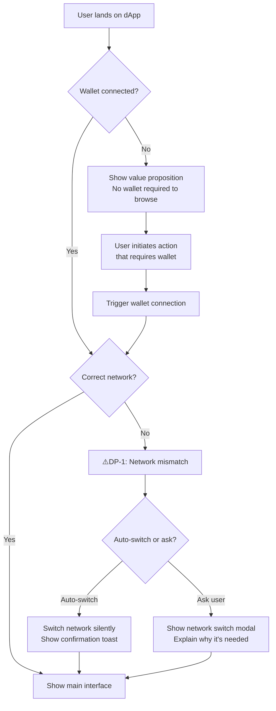

# web3-flow

Generate flows. Map every state, every branch, every point where a design decision needs to be made.

## When to use

- After `/web3-brief` to translate research into flows
- When mapping the UX of an existing product
- When redesigning a specific flow

## Process

### Step 1 — Load context

Read `web3-context.md` and `web3-brief.md` from the current directory.

If neither exists:
> I need project context and research before generating flows. Run `/web3-context` and `/web3-brief` first.

If only context exists (no brief):
> I have your project context but no research brief. I can generate flows with assumptions, but the output will be more accurate after running `/web3-brief`. Proceed with assumptions? (yes/no)

### Step 2 — Identify flows to generate

Based on the key flows in web3-context.md, identify which task flows to generate.

Always generate:
1. **Primary flow** — the most critical user journey (the first one listed in key flows)
2. **Error states** — what happens when each step fails
3. **Wallet state flows** — not connected, wrong network, insufficient funds

Ask the user if they want additional flows generated.

### Step 3 — Generate flows in Mermaid

For each flow, produce:

**A. The Mermaid diagram**

Use `flowchart TD` format. Include:

- Every meaningful state as a node
- Decision points as diamonds `{}`
- Web3-specific states (see state library below)
- Error paths alongside the happy path
- Decision points marked with `⚠️DP` label

Example structure:

**B. Decision points explained**

For every `⚠️DP` node in the diagram, add a written explanation:

---
**⚠️ DP-1: Network mismatch — auto-switch or ask?**

**If single-chain product:** Auto-switch with a toast notification. The user didn't choose the wrong network intentionally — removing friction here reduces abandonment without risk.

**If multichain product:** Show an explicit modal. The user may have intentionally switched networks. Auto-switching could move them away from funds they were managing. Ask first, explain why.

**Reference:** ethux / Multi-Chain — automatic network switching pattern.

---

### Web3 state library

Always map these states explicitly when they apply to the flow:

**Wallet states**
- `Wallet not connected` — user has no wallet or hasn't connected
- `Wallet connected — wrong network` — connected but on incorrect chain
- `Wallet connected — correct network` — ready to transact
- `Wallet locked` — wallet exists but is locked (MetaMask, hardware)

**Transaction states**
- `Idle` — no pending action
- `Awaiting signature` — user must sign in wallet
- `Pending` — transaction submitted, waiting for confirmation
- `Confirmed` — transaction included in a block
- `Failed` — transaction reverted or rejected
- `Dropped` — transaction replaced or timed out

**Balance states**
- `Not configured` — feature not set up (privacy tools, new wallets)
- `Loading` — fetching on-chain data
- `Active` — normal state with balance
- `Genuinely zero` — configured but empty

**Approval states** (DeFi)
- `No allowance` — token spending not approved
- `Partial allowance` — approved but insufficient for this action
- `Sufficient allowance` — ready to transact
- `Unlimited allowance set` — user previously approved unlimited

**Connection states** (multichain)
- `Correct chain` — user is on the expected chain
- `Wrong chain — known` — user is on a recognized but incorrect chain
- `Wrong chain — unknown` — user is on an unrecognized chain

### Step 4 — Checkpoint

After generating the primary flow:

> Here are the flows for [product name].
>
> I've marked [N] decision points that require your input. For each one, your choice will shape the final flow:
>
> [List each DP with the two or three options]
>
> Make your calls on each decision point, and I'll finalize the flows and generate `web3-flow.md`.

Wait for the user's decisions. Incorporate them into the final diagrams.

### Step 5 — Write output

Write `web3-flow.md` with:
- All Mermaid diagrams (one per flow)
- All decision points with the chosen approach noted
- A summary of flows generated

Confirm:
> ✓ **web3-flow.md generated** with [N] flows and [M] decision points resolved.
>
> Next step: run `/web3-wireframe` to generate low-fi wireframes in Figma based on these flows.
